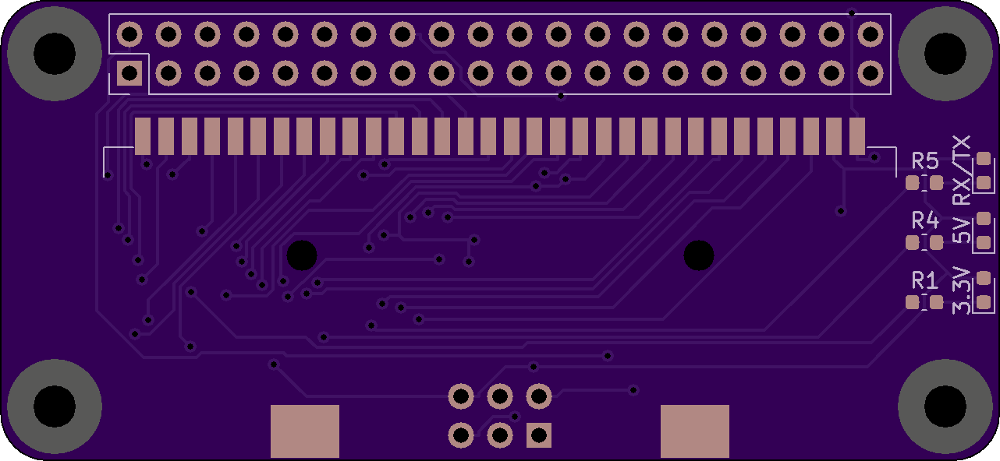
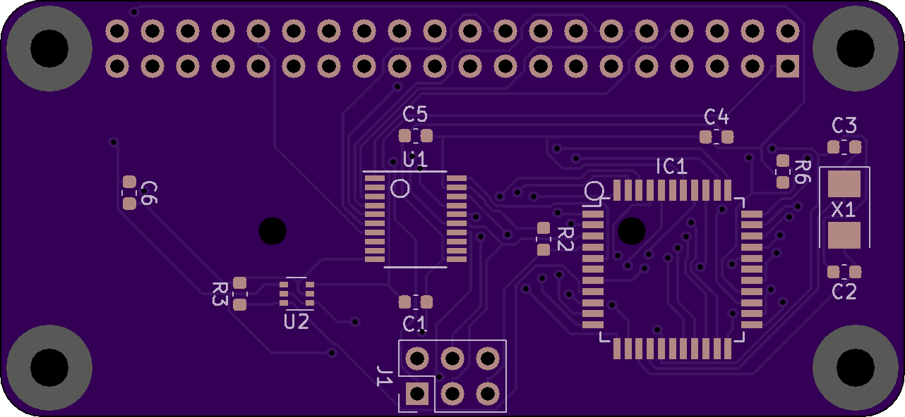

# GBxHAT

**A GBxCart RW in PiZero Hat format**

Purchase on [OSHPark](https://oshpark.com/shared_projects/tci8x5sD)

Uses the original schematic by [InsideGadgets](https://github.com/insidegadgets/GBxCart-RW) with some changes

Uses the Pi Zero HAT template by [Mike Lawrence](https://github.com/mikelawrence/RPi_Zero_pHat_Template)

The CH340 was removed, as TX and RX are connected straight to the pi zero

[Interactive BOM](https://martinrefseth.com/ibom/GBxHat)

**Keep in mind that this is untested and has no software**

## Images

